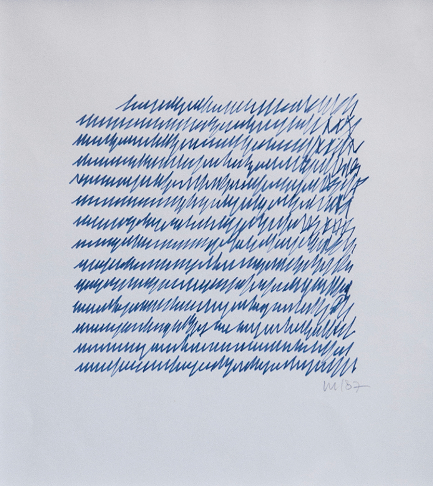
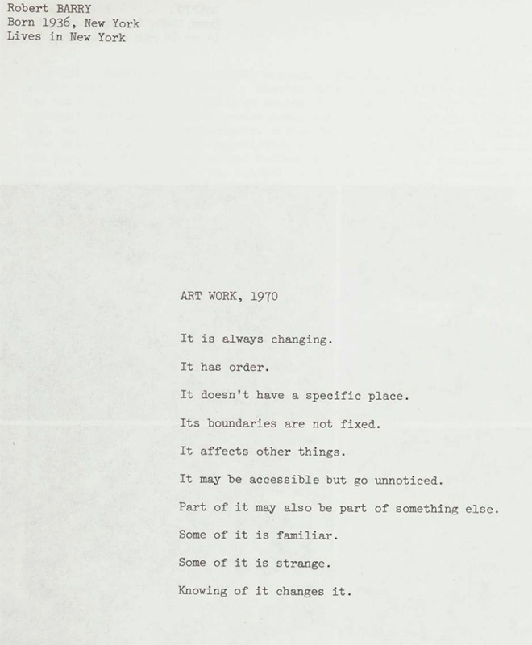
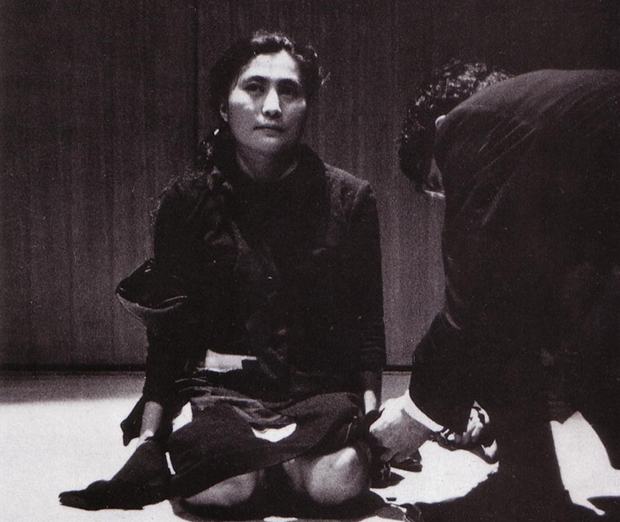
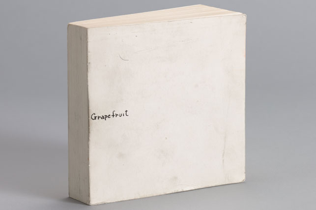
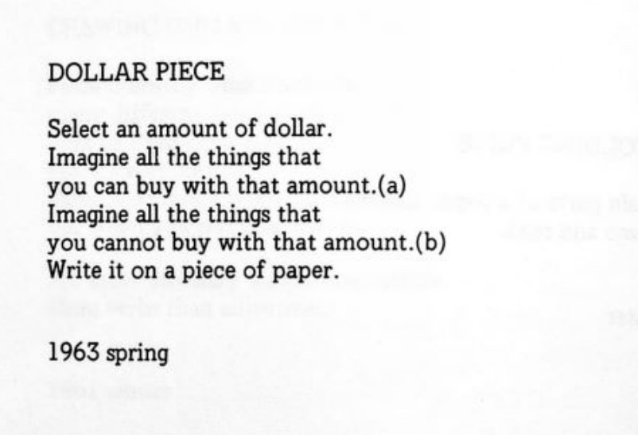
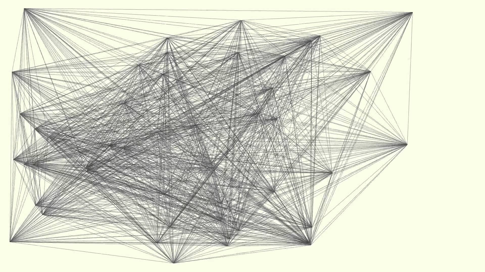

# Playing with Code(s)

Code can be approached as a conceptual framework.
We could also consider here substituting the word code for conditions or instructions.

To make code is to make the conditions for something to be generated.

In this class, we'll be considering code in a literal sense, as computer code. However, the history of code in art has been informed by a long relationship between instructions, art, and games.

## Rules as Code: Danish Clapping Game

Play in pairs

Instructions:

- Face your partner and clap your thighs at the same time.

- Choose an arm position randomly: Both arms up, both arms to the left, both arms to the right.

- If you choose the same position, clap hands and repeat from the top. If you choose different positions, repeat from the top.

## Code and Art

### Vera Molnar

<figure> <figcaption>Vera Molnar. Lettres de ma Mère (“Letter from my Mother”). 1987. Courtesy of The Anne and Michael Spalter Digital Art Collection</figcaption></figure>


## Loose Codes of Art

### Robert Barry

<figure> <figcaption>Robert Barry. ART WORK. 1970.</figcaption></figure>

### Yoko Ono

<figure> <figcaption>Yoko Ono. Cut Piece. 1964.</figcaption></figure>

<figure> <figcaption>Yoko Ono. Grapefruit. 1964. </figcaption></figure>

<figure> <figcaption>Yoko Ono. DOLLAR PIECE. 1963. </figcaption></figure>

Instructions:
```
DOLLAR PIECE

Select an amount of dollar.
Imagine all the things that
you can buy with that amount.(a)
Imagine all the things that
you cannot buy with that amount.(b)
Write it on a piece of paper.


1963 spring
```

## Strict Codes of Art

### Mel Bochner

<figure> <figcaption>Mel Bochner. Measurement Room: No Vantage Point. 2019–2020.</figcaption></figure>

### Sol LeWitt

<figure> <figcaption>Sol LeWitt. Wall Drawing #118. 1971 </figcaption></figure>

Instructions:

“On a wall surface, any continuous stretch of
wall, using a hard pencil, place fifty points at
random. The points should be evenly distributed
over the area of the wall. All of the points should
be connected by straight lines.”

[Sol LeWitt: A Wall Drawing Retrospective - MASS MoCA](https://www.youtube.com/embed/c4cgB4vJ2XY?si=qiUEQj92Rs8d8plU)

Modified version of #118 for paper:

```
On a pieces of paper, using a pencil,
place twenty points evenly distributed
over the area of one of the paper's sides.
All of the points should be connected
with straight lines.
```

## Game Codes: Dots & Boxes

Instructions:
```
Draw a three by three  grid of dots

Each player takes turns drawing a horizontal
or vertical line that connects two dots

The player who completes the fourth
side of a 1×1 box earns one point 
and takes another turn (mark initials in the box)

The player with the most boxes at the end wins
```

## In-class exercise: Conditional Drawing

Using Sol LeWitt as a starting point, design your own set of conditions that produce a drawing.

In this exercise, try to be as percise as possible with your instructions, while still leaving room for generative variation.

Make one drawing with your conditions, then refine your *code*.

After some time, we'll exchange our conditions and see what drawings emerge.

## Independent Exercise: Sign up for p5.js

We will be using p5.js for this class. To use p5.js you will need to make an account.

[Sign Up](https://editor.p5js.org/signup)


