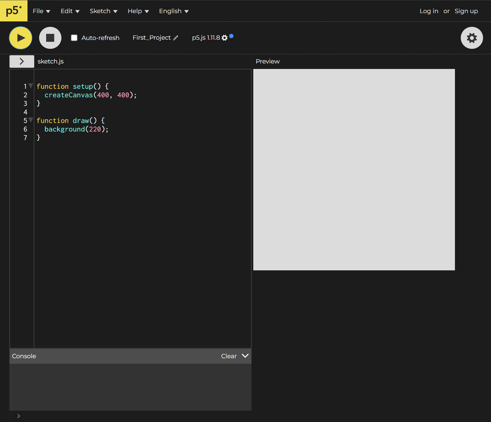
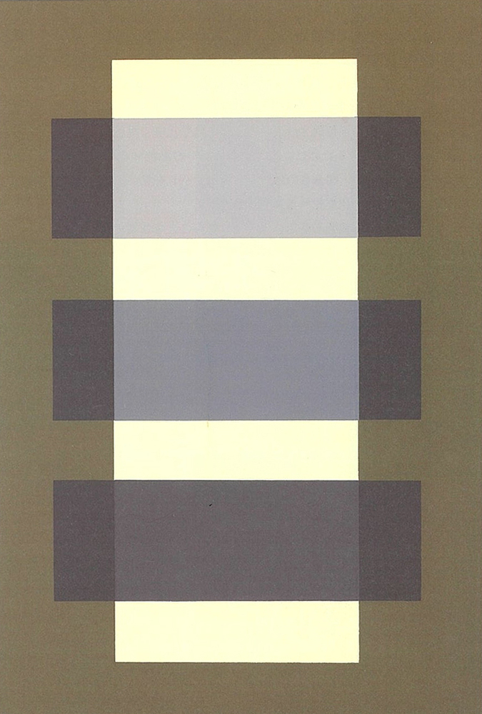

<script>hljs.highlightAll();</script>

# p5.js, Shapes and Color

Get started by going to the [p5.js editor website](https://editor.p5js.org/).

## About p5.js

[**p5.js**](https://p5js.org/) is an open source project. It is a JavaScript library adaptation of the open source project Processing developed by [Casey Reas](https://reas.com/) and [Ben Fry](https://www.benfry.com/) in 2001. p5.js is a development environment in which artists and designers can both produce software art and learn how to code.

p5.js and Processing conceptually builds on the idea that artists make use of forms of "programming" and instructions.

<figure> <figcaption> Agnes Martin. Untitled. 1999.</figcaption> </figure>

<figure> <figcaption> Sol LeWitt. Wall Drawing #260. 1975.</figcaption> </figure>

p5.js is a tool for making software.

[**p5.js**](https://p5js.org/) was first developed by [Lauren Lee McCarthy](https://get-lauren.net/) in 2013.

## Artist Spotlight

### Casey Reas
> American, b. 1972

> [Artist Website](https://reas.com/)

#### *Atomism*

Series, 2012-Present

<figure> <figcaption> Casey Reas. Still Life (RGB A). 2016.</figcaption> </figure>

<figure> <figcaption> Casey Reas. RGB-056-006-080-823-715. 2015.</figcaption> </figure>

<figure> <figcaption> Casey Reas. RGB-056-006-080-823-715. 2015.</figcaption> </figure>

### Lauren Lee McCarthy
> American, b. 1987

> [Artist Website](https://get-lauren.net/)

#### *Auto*

2025

[Website](https://get-lauren.net/Auto)

<figure> <figcaption>Lauren Lee McCarthy. Auto. 2025</figcaption> </figure>

#### *Surrogate*

2021

[Website](https://get-lauren.net/Surrogate)

<figure> <figcaption>Lauren Lee McCarthy. Surrogate. 2021</figcaption> </figure>

## What is p5.js?

We spent our first day drawing with our human-understandable instructions. To write instructions for our computer to make artworks with our computer, we need to write our instructions in a language the computer understands.

To do that, we will write instructions in the language p5.js uses: JavaScript.

<figure> <figcaption>Interface of p5 Editor</figcaption> </figure>

### p5.js Editor

If you have done so already, head to the p5 [Editor](https://editor.p5js.org/).

The p5 editor allows us to write code for our browser in our browser!

If you haven't done so already, you can sign up for an account and login.

The interface of the p5 Editor is fairly simple:

- The area on the left is where we can write our instructions (also known as *code*) for our artworks.
- The play button at the top allows us to run our code.
- The stop button stops our code.
- The top menus allow us to access various options related to the p5 editor.

### Customizing your p5 editor

I recommend using p5 in High Contrast mode.

You can change to High Contrast mode by clicking on the gear icon and going to General Settings.

You can also customize your Text Size for easier reading.

### Saving and Renaming

You can save your sketch by pressing **ctrl+s** of navigating to file -> save.

You can rename your sketch by clicking on your project name next to the pencil icon.

## Drawing with Code

Code is written in particular "languages." These languages are not as complicated as "human" languages, but each language is slightly different and expects you to write your code in specific ways.

### createCanvas()
[Reference](https://p5js.org/reference/p5/createCanvas/)

`createCanvas()` is a function that sets the size of our canvas.

The way to call a function, sometimes referred to as a command, is the function name followed by open and closed parentheses.

Functions are very similar to how you might have learned them in your math classes, such as f(x).

A function takes in a value, x, and oftentimes, returns a value, f(x).

It is important to note that not all functions take in values, but we will talk about that a bit later.

`createCanvas()`, for example, takes in the parameters **width** and **height**.

The reference for `createCanvas()` would look something like this:

---

Syntax: `createCanvas(a, b)`

Parameters

- **a**		- width
- **b**		- height
---

**Syntax** is the word we use to describe the particular writing style of a programming language. Every programming language has a different **syntax**.

The syntax for creatCanvas is that it takes in and a and b parameter.

a is equal to the width of our sketch and b is equal to our height.

If we want our sketch to be 400 pixels by 400 pixels we could write;

```js
function setup(){
    //Set our sketch to 800 by 800 pixels
    createCanvas(400,400);
}

```

Notice the "//" on the first line. This marks a comment. A comment is meant for human programmers and is not "read" by our computer.

Also notice the semi colon ";" at the end of the second line. For our purposes now, we can think of the semi colon as a period, marking the end of our line of code.

### Errors

If I spell 'createCanvas()' incorrectly, my sketch won't run, and p5 will let me know I have an error.

```js
function setup(){
    //Set our sketch to 400 by 400 pixels
    createCanva(400,400);
}
```
<figure> <figcaption>Error message</figcaption> </figure>

### background()

[Reference](https://p5js.org/reference/p5/background/)

`background()` is a function that sets the background for our sketch.

`background()` can take in many different types of parameters including color values and images. For now we'll focus on setting a grayscale value.

---

Syntax: `background(a)`

Parameters

- **a**		- Gray value (0-255)

---

To draw a middle gray background on our sketch:

```js
function setup(){
    //Set our sketch to 400 by 400 pixels
    createCanvas(400,400);
}

function draw(){
    background(127);
}
```

### setup() and draw()

We'll get more into how `setup()` and `draw()` function in the next class. For now, we can think of `setup()` as where we set up our sketch by drawing our canvas, and `draw()` is where we can make our drawing. We want to make sure that our code is in between the `{ }` of the function.

### circle()

[Reference](https://p5js.org/reference/p5/circle/)

`circle()` is a function that draws a circle to our canvas.

---

Syntax: `circle(a, b, c)`

Parameters

- **a**		 - x-coordinate of the circle
- **b**		- y-coordinate of the circle
- **c**		- width and height

---


<figure> <figcaption>Coordinate system of p5.js</figcaption> </figure>

<figure> <figcaption> Our current sketch with grid lines every 10 pixels</figcaption> </figure>

To draw a circle with a diameter of 200 in the center of our screen we would write:

```js
function draw(){
    background(127);
    circle(200,200,100);
}
```
<figure> <figcaption> Our circle</figcaption> </figure>

<figure> <figcaption> Our circle on a coordinate grid</figcaption> </figure>

### Drawing Order

The order that we write our code is important! The computer "reads" our code from the top to bottom, just like we do. The drawing order in p5 is the same. Each shape is drawn on top of the previous shape.

Try adding a line of code to make a new circle in the center of our our sketch with a diameter of 200 pixels.

```js
circle(200,200,200);
```

Because our code now looks like this:

```js
function setup(){
    //Set our sketch to 400 by 400 pixels
    createCanvas(400,400);
}

function draw(){
    background(127);
    circle(200,200,100);
    circle(200,200,200);
}
```
We are first drawing our background, then drawing our smaller circle, and, finally, the larger circle on top.

<figure> <figcaption> Our larger circle covering our smaller circle</figcaption> </figure>

If we change the ordering of our circles:
```js
circle(400,400,200);
circle(400,400,100);
```
We'll see the smaller circle drawn on top of the larger one:

<figure> <figcaption> </figcaption> </figure>

### rect() and square()

[Reference](https://p5js.org/reference/p5/rect/) 

`rect()` draws a rectangle to our screen.

---

Syntax: `rect(a, b, c, d)`	

Parameters

- **a**		- x-coordinate
- **b**		- y-coordinate
- **c**		- width 
- **d**		- height

---

For drawing a rectangle with equal sides, we can also use the `square()` function. Although for most of this course you might find it helpful to change the sides of your rectangle independently of one another.

---

Syntax: `square(a, b, c)`	

Parameters

- **a**		- x-coordinate
- **b**		- y-coordinate
- **c**		- width and height

---

Try drawing a square at (200,200) with a size and width of 100.

```java
rect(400,400,100,100);
```

What do you notice?

<figure> <figcaption> </figcaption> </figure>

Unlike `circle()` which places the circle's center at the given (x,y) parameter, `rect()` places the rectangle at its top left corner. We can think of this as similar to how you might draw out a rectangle on the desktop of your computer.

### rectMode()

[Reference](https://p5js.org/reference/p5/rectMode/)

We can modify how rectangles are drawn by using the function `rectMode()`.

`rectMode()` can take in a few parameters, but we will focus on `CENTER` and `CORNER`

`rectMode(CORNER)` is the default behavior with our rectangle being drawn from the upper left corner.

`rectMode(CENTER)` will draw our rectangle at the center of the given (x,y) coordinates.

If we were to write:

```js
rect(200,200,100,100);
rectMode(CENTER);
```

We would notice that nothing happens.

For `rectMode()` to work properly, we need to tell our computer to draw our rectangles in the center *before* drawing our rectangle.

If we write:
```js
rectMode(CENTER);
rect(200,200,100,100);
```
We get this result:

<figure> <figcaption> </figcaption> </figure>

In essence, `rectMode()` will affect any rectangle after it is called. With this in mind, we can call `rectMode()` multiple times in a sketch to change the behavior of different rectangles.

Let's try writing:

```js
rectMode(CENTER);
rect(200,200,100,100);
rectMode(CORNER);
rect(200,200,100,100);
```
We can see our first rectangle remain in the center, while our second is drawn from the corner.

<figure> <figcaption> </figcaption> </figure>

### fill()

[Reference](https://p5js.org/reference/p5/fill/)

`fill()` is similar to `rectMode()` in that it changes the behavior of our shapes. `fill()` sets the color that shapes are filled with.

Before moving onto color, `fill()` can also take in a `gray` value between 0 - 255.

---

Syntax: `fill(a)`

Parameters

- **a**		- Gray value (0-255)

---

Writing `fill()` before our most recent rectangle:

```js
rectMode(CORNER);
fill(127);
rect(200,200,100,100);
```

It changes the color of our rectangle to gray.

<figure> <figcaption> </figcaption> </figure>

## Drawing Exercise

Navigate to **File** -> **New**

For this exercise, create the below 400 by 400 pixel drawing using the code we have learned so far.

Additionally, to get comfortable looking at p5's reference, to complete this exercise, you'll need to look into the following functions and figure out how to use them in your sketch.

`line()` [(Reference)](https://p5js.org/reference/p5/line/) - Draws lines to screen

`stroke()` [(Reference)](https://p5js.org/reference/p5/stroke/) - Sets line and border color

`noStroke()` [(Reference)](https://p5js.org/reference/p5/noStroke/) - Turns off strokes

`strokeWeight()` [(Reference)](https://p5js.org/reference/p5/strokeWeight/) - Changes the thickness of strokes

Be sure add comments to your code to keep track of what you are writing!

Begin with:

```js
function setup(){
    //Set our sketch to 400 by 400 pixels
    createCanvas(400,400);
}

function draw(){
    background(200);
}
```
<figure> <figcaption> </figcaption> </figure>

## Color

[Josef & Anni Albers Foundation](https://www.albersfoundation.org/)

<figure> <figcaption>Anni Albers. Black White Yellow. 1926.</figcaption> </figure>

<figure> <figcaption>Josef Albers. Homage to the Square: "Ascending". 1953.</figcaption> </figure>

<figure> <figcaption>Recreation of Josef Albers' painting in p5</figcaption> </figure>

[Code](https://editor.p5js.org/pickpanpuck/sketches/31j-o30qC)

If we open this sketch into p5, we notice our `fill()` looks quite different. Before we would write `fill(127);` and see our shapes turn gray.

Now we can see the syntax is `fill(a, b, c)`. p5 by default represents colors in Red, Green and Blue values, or RGB for short.

---

Syntax: `fill(a,b,c)`

- **a**		- amount of red (0-255);
- **b**		- amount of green (0-255);
- **c**		- amount of blue (0-255);

---

This is also true for our `background()`

---

Syntax: `background(a,b,c)`

- **a**		- amount of red (0-255);
- **b**		- amount of green (0-255);
- **c**		- amount of blue (0-255);

---


Try changing some of the colors in the Albers' sketch to see the effects.

With RGB, we "mix" red, green, and blue together to get different results.

For example if we wanted to fill our shapes with yellow, we would write:

```js
//Yellow in RGB
fill(255,255,0);
```

<figure> <figcaption>A yellow circle</figcaption> </figure>

Mixing RGB values leads to a variety of colors:

```js
//purple
fill(255,0,255);

//cyan
fill(0,255,255);

//white
fill(255,255,255);

//black
fill(0,0,0);
```

### Color Exercise

Using Google's Color Picker tool for reference, create and 400 x 400 image of three or more shapes that, next to each other, form a gradient. Choose a background color that complements your gradient.

Example:

<figure> <figcaption>Three circles forming a color gradient</figcaption> </figure>


## Opacity

<figure> <figcaption>Josef Albers' opacity illusion painting</figcaption> </figure>

<figure> <figcaption>Recreation of Josef Albers' painting using opacity</figcaption> </figure>

[Code](https://editor.p5js.org/pickpanpuck/sketches/8VXvAztpk)

With our colors for our `fill()`, there is a hidden fourth parameter, **alpha**, commonly known as opacity!

---

Syntax: `fill(a, b, c, d)`

- **a**		- amount of red (whole number  0-255)
- **b**		- amount of green (whole number 0-255)
- **c**		- amount of blue (whole number 0-255)
- **d**		- alpha (decimal number 0-255)

---

<div class = "div-container">
    <div style = "width: 46%;">
        <figure> <figcaption>Circle at full opacity</figcaption> </figure>
    </div>

<div style = "width: 46%;">
<figure> <figcaption>Circle at half opacity</figcaption> </figure>
</div>
</div>
<div class = "div-container">
    <div style = "width: 46%;">
<figure> <figcaption>Circle at quarter opacity</figcaption> </figure>
    </div>

<div style = "width: 46%;">
<figure> <figcaption>Notice how the background color blends with my shape's fill color</figcaption> </figure>
</div>
</div>

## Opacity Exercise

Try creating an image similar to the one you created for the Color Exercise. Instead of using multiple colors, use one color and change the alpha parameter of the `fill()` function.

## Sharing your Sketch

To share your sketch from p5.js:

1. Make sure you are logged in and your sketch is saved.
2. Navigate to **File** -> **Share**
3. You can copy your Fullscreen or Edit link to share with others! (We'll discuss Embed later).

## Independent Exercise: Drawing in Color

**Due next at the start of next class session.**

### Part 1: Turrell

At either sunrise or sunset between now and our next class session attend the lighting program at James Turrell's *Dividing the Light* at Pomona College [Skyspace](https://www.pomona.edu/museum/collections/james-turrell-skyspace).

<figure> <figcaption>James Turell. Dividing the Light. 2007.</figcaption> </figure>

Reflect on your experience of the relationship between the LED color lights and the color of the sky. This work is a form of new media art! The lights that are part of the work had to be programmed to match with the time of day and to change colors as the sky changes.

**Exercise:** Write a poetic set of instructions for James Turrell's *Dividing the Light*. How would you describe the colors? What is the progression of the piece? Be as specific as possible. Next class we'll be talking about how we can change values within our code while our program is running. Consider what values are changing with the lights to give different results.

### Part 2: Pusey

Read the article about the work of Mavis Pusey posted to discord.

Using p5.js, recreate the below portion of Pusey's painting *Personante* as a 400x400 sketch.

To make this image, you'll need to look into the functions `quad()` [(Reference)](https://p5js.org/reference/p5/quad/) and `triangle()`[(Reference)](https://p5js.org/reference/p5/triangle/).

As a hint you can draw shapes beyond our 400 x 400 canvas!

#### Mavis Pusey's *Personante*

<figure> <figcaption> Mavis Pusey. Personante. 1990.</figcaption> </figure>
<figure> <figcaption> Portion of painting to recreate in p5</figcaption></figure>
<figure> <figcaption>Portion of painting with grid lines every 50 pixels</figcaption> </figure>

<figure> <figcaption>Colors of painting with RGB values</figcaption> </figure>

### Submit

Submit to Canvas:

1. Share your p5 Edit link
3. Text of your *Dividing the Light* instructions.

Submit to Discord:

1. Share your p5 Edit link
2. Text of your *Dividing the Light* instructions.


