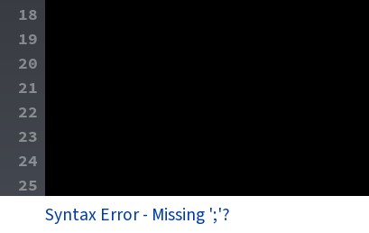
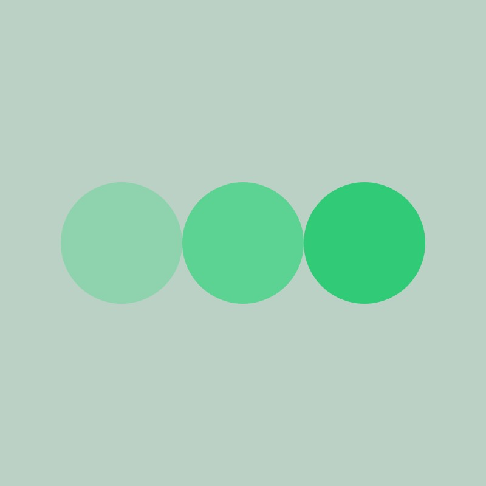

<script>hljs.highlightAll();</script>

<script>
// Get the header element
let header = document.querySelector('header');

// Get the height of the header
document.querySelectorAll('a[href^="#"]')
.forEach(function (anchor) {
    anchor.addEventListener('click', 
    function (event) {
        event.preventDefault();

        // Get the target element that 
        // the anchor link points to
        let target = document.querySelector(
            this.getAttribute('href')
        );
        
        let headerHeight = header.offsetHeight*2;
        
        let targetPosition = target
            .getBoundingClientRect().top - headerHeight;

        window.scrollTo({
            top: targetPosition + window.scrollY,
            behavior: 'smooth'
        });
    });
});
</script>


# Processing, Shapes and Color

Get started by openning up **Processing** on your computers.

## About Processing

[**Procesing**](https://processing.org/) is an open source project by [Casey Raes](https://reas.com/) and [Ben Fry](https://www.benfry.com/). It is a development environment in which artists and designers can both produce software art and learn how to code.

Processing conceptually builds on the idea that artists make use of forms of "programming" and instructions.

<figure> <figcaption> Agnes Martin. Untitled. 1999.</figcaption> </figure>

<figure> <figcaption> Soll LeWitt. Wall Drawing #260. 1975.</figcaption> </figure>

Processing is a tool for making software.

Processing's approach to software:

- Software is a unique medium with unique qualities
- Every programming language is a distinct material
- Sketching is necessary for the development of ideas
- Programming is not just for engineers

> "Processing...repositions programming in a way that is accessible to people who are
interested in programming but who may be intimidated by or uninterested in the type
taught in computer science departments. The computer originated as a tool for fast
calculations and has evolved into a medium for expression."
>
> -Casey Raes, Ben Fry - Processing: a programming handbook for visual designersand artists

**Processing** started in 2001 and has grown into the [**Processing Foundation**](https://processingfoundation.org/) which includes a web interpretation of Processing called [**P5.js**](https://p5js.org/), created by [Lauren Lee McCarthy](https://get-lauren.net/).

<figure> <figcaption> Still Life (RGB A), 2016, Casey Raes</figcaption> </figure>

<figure> <figcaption> Auto, 2025, Lauren Lee McCarthy</figcaption> </figure>

## What is Processing?

We spent our first day drawing with are human understandable instructions. To write instructions for our computer to make artworks with our computer, we need to write our instructions in a language the computer understanding.

To do that we are going to be writing instructions for our code in the Processing programming language.

Processing is built on **Java.**

<figure> <figcaption>Interface of Processing</figcaption> </figure>

### Interface of Processing

The interface of Processing is fairly simple:

- The large area in the center functions like a text editor where we can enter the instructions (also know as *code*) for our artworks.
- The play button at the top allows us to run our code.
- The stop button stops our code.
- The top menus allow us to access various options related to the Processing editor.

### Customize your Processing Editor

Navigate to **Tools** -> **Theme Selector** -> the select a theme.

<figure> <figcaption>Selecting a Dark Mode theme</figcaption> </figure>

## Drawing with Code

Code is written in particular "languages." These languages are not as complicated as "human" languages, but each langague is slightly different and expects you to write your code is specific ways.

### size()

[**size()**](https://processing.org/reference/size_.html) sets the size of our sketch.

**size()** takes in the parameters **width** and **height**.

size(width, height);

if we want our sketch to look be 800 pixels by 800 pixels we could write;

```java
//Set our sketch to 800 by 800 pixels
size(800,800);
```

Notice the "//" on the first line. This marks a comment. A comment is meant for human programmers and is not "read" by our computer.

Also notice the semi colon ";" at the end of the second line. For our purposes now, we can think of the semi colon as a period, marking the end of our line of code.

### Errors

If I forget to add a semicolon, my sketch won't run, and Processing will let me know I have an error.

```java
//Set our sketch to 800 by 800 pixels
size(800,800)
```

<figure> <figcaption></figcaption> </figure>

### background()

[backgroud()](https://processing.org/reference/background_.html) sets the background for our sketch.

Background can take in many different types of parameters including color values and images. For now we'll focus on setting a gray scale value.

background(gray) - gray is a decimal number between 0 and 255 with black being 0 and 255 being white.

To draw a middle gray background on our sketch:

```java
//Draw a middle gray background
background(127);
```

### ellipse()

[Reference](https://processing.org/reference/ellipse_.html)

`ellipse()` draws an ellipse to our screen.

`ellipse(a, b, c, d)`

Parameters

- **a**		 - x-coordinate of the ellipse
- **b**		- y-coordinate of the ellipse
- **c**		- width of the ellipse by default
- **d**		- height of the ellipse by default


<figure> <figcaption>Coordinate system of Processing</figcaption> </figure>

<figure> <figcaption> Our current sketch with grid lines every 20 pixels</figcaption> </figure>

To draw a circle with a diameter of 200 in the center our screen we would write:

```java
ellipse(400,400,200,200);
```
<figure> <figcaption> Our ellipse</figcaption> </figure>

<figure> <figcaption> Our ellipse on a coordinate grid</figcaption> </figure>

### Drawing Order

The order that we write our code is important! The computer "reads" our code from the top to bottom, just like we do. The drawing order in Processing is the same. Each shape is drawn on top of the previous shape.

Try adding a line of code to make a new circle in the center our our sketch with a diameter of 400 pixels.

```java
ellipse(400,400,400,400);
```

Because our code now looks like this:

```java
//Set our sketch to 800 by 800 pixels
size(800,800);

//Draw a middle gray background
background(127);
ellipse(400,400,200,200);
ellipse(400,400,400,400);
```
We are first drawing our background, then drawing our smaller ellipse, and, finally, the larger ellipse on top.

<figure> <figcaption> Our larger ellipse covering our smaller ellipse</figcaption> </figure>

If we change the ordering of our ellipses:
```java
ellipse(400,400,400,400);
ellipse(400,400,200,200);
```
We'll see the smaller ellipse drawn on top of the larger one:

<figure> <figcaption> </figcaption> </figure>

### rect()

[Reference](https://processing.org/reference/rect_.html) 

`rect()` draws a rectangle to our screen.

`rect(a, b, c, d)`	

Parameters

- **a**		- x-coordinate
- **b**		- y-coordinate
- **c**		- width 
- **d**		- height

Try drawing a square at (400,400) with a size and width of 200.

```java
rect(400,400,200,200);
```

What do you notice?

<figure> <figcaption> </figcaption> </figure>

Unlike `ellipse()` which places the ellipse's center at the given (x,y) parameter, `rect()` places the rectangle at its top left corner. We can think of this as simliar to how you might draw out a rectangle on the desktop of your computer.

### rectMode()

[Reference](https://processing.org/reference/rectMode_.html)

We can modify how rectangles our drawn by using the function `rectMode()`.

`rectMode()` can take in a few parameters, but we will focus on `CENTER` and `CORNER`

`rectMode(CORNER)` is the default behavior with our rectangle being draw from the upper left corner.

`rectMode(CENTER)` will draw our retangle at the center of the given (x,y) coordinates.

If we were to write:

```java
rect(400,400,200,200);
rectMode(CENTER);
```

We would notice that nothing happens.

For `rectMode()` to work properly, we need to tell our computer to draw our rectangles in the center *before* drawing our rectangle.

If we write:
```java
rectMode(CENTER);
rect(400,400,200,200);
```
We get this result:

<figure> <figcaption> </figcaption> </figure>

In essence, `rectMode()` will effect any rectangle after it is called. With this in mind, we can call `rectMode()` multiple times in a sketch to change the behavior of different rectangles.

Let's try writing:

```java
rectMode(CENTER);
rect(400,400,200,200);
rectMode(CORNER);
rect(400,400,200,200);
```
We can see out first rectangle remain in the center, while our second is drawn from the corner.

<figure> <figcaption> </figcaption> </figure>

### fill()

`fill()` is simliar to `rectMode()` in that it changes the behavior of our shapes. `fill()` sets the color that shapes are filled with.

Before moving onto color, `fill()` can also take in a `gray` value between 0 - 255.

Writing `fill()` before our most recent rectangle:

```java
rectMode(CORNER);
fill(127);
rect(400,400,200,200);
```

It changes the color of our rectangle to gray.

<figure> <figcaption> </figcaption> </figure>

## Drawing Exercise

For this exercise, create the below 800 by 800 pixel drawing using the code we have learned so far.

Additionally, to get comfortable looking at Processing's reference, to complete this exercise, you'll need to look into the following functions and figure out how to use them in your sketch.

`line()` [(Reference)](https://processing.org/reference/line_.html) - Draws lines to screen

`stroke()` [(Reference)](https://processing.org/reference/stroke_.html) - Sets line and border color

`noStroke()` [(Reference)](https://processing.org/reference/noStroke_.html) - Turns off strokes

`strokeWeight()` [(Reference)](https://processing.org/reference/strokeWeight_.html) - Changes the thinkness of strokes

Be sure to comment your code to keep track of what you are writing!

Begin with:

```java
size(800,800);
background(200);
```
<figure> <figcaption> </figcaption> </figure>

## Color

[Reference](https://processing.org/tutorials/color)

<figure> <figcaption>Josef Albers. Homage to the Square: "Ascending". 1953.</figcaption> </figure>

<figure> <figcaption>Recreation of Josef Alber's painting in Processing</figcaption> </figure>

Code:

```java
//Home to the Square: "Ascending"

size(800, 800);

background(247, 238, 220);

//Attribues
noStroke();
rectMode(CENTER);

//Squares
fill(138, 200, 237);
rect(400, 400, 780, 780);

fill(196, 195, 194);
rect(400, 440, 630, 630);

fill(255, 250, 244);
rect(400, 478, 470, 470);

fill(254, 226, 21);
rect(400, 517, 313, 313);
```

If we copy this sketch into processing, we notice our `fill()` looks quite different. Before we would write `fill(127);` and see our shapes turn gray.

Now we can see the syntax is `fill(a, b, c)`. Processing by default represents colors in Red, Blue and Green values, or RGB for short.

- **a**		- amount of red (0-255);
- **b**		- amount of green (0-255);
- **c**		- amount of blue (0-255);

Try changing some of the colors in the Alber's sketch to see the effects.

With RGB, we "mix" red green and blue togeter to get differnt results.

For example if we wanted to fill our shapes will yellow, we would write:

```java
//Yellow in RGB
fill(255,255,0);
```

<figure> <figcaption>A yellow ellipse</figcaption> </figure>

Mixing RGB values leads to a variety of colors:

```java
//purple
fill(255,0,255);

//cyan
fill(0,255,255);

//white
fill(255,255,255);

//black
fill(0,0,0);
```
### Color Selector

We can also see the RGB values of colors using Processing's built in color picker.

Navigate to **Tools** -> **Color Selector**

<figure> <figcaption>A yellow ellipse</figcaption> </figure>

### Color Exercise

Using the the **Color Selector** tool for reference, create and 800 x 800 image of three or more shapes that, next to each other, form a gradient. Choose a background color that compliments your gradient.

Example:

<figure> <figcaption>Three ellipses forming a color gradient</figcaption> </figure>


## Opacity

<figure> <figcaption>Josef Alber's opacity illusion painting</figcaption> </figure>

<figure> <figcaption>Recreation of Josef Alber's painting using opacity</figcaption> </figure>

Code:

```java
background(134, 119, 90);

noStroke();
rectMode(CENTER);

fill(97, 88, 89);

//Three rectangles behind
rect(337.5, 500, 520, 170);
rect(337.5, 750, 520, 170);
rect(337.5, 250, 520, 170);

//Main Center rectanlge
fill(254, 255, 223);
rect(337.5, 500, 350, 850);


//Center Rectangles with Opacity
fill(97, 88, 89, 230);
rect(337.5, 750, 350, 170);

fill(97, 88, 89, 180);
rect(337.5, 500, 350, 170);

fill(97, 88, 89, 100);
rect(337.5, 250, 350, 170);
```
With our colors for our `fill()`, there is a hidden fourth parameter, **alpha**, commonly known as opacity!

 `fill(a, b, c, d)`

- **a**		- amount of red (0-255);
- **b**		- amount of green (0-255);
- **c**		- amount of blue (0-255);
- **d**		- alpha (0-255)

We'll talk about this more next class, but for now note the while **alpha** can be a decimal number(e.g. 1.67, 3.14, 88.666), our RGB values can only be entered in as whole number (e.g. 0, 45, 73).

In programming, a whole numbers is called an **integer** or `int`, for short. A decminal number is called **floating-point number**, or `float` for short. We will go into more detail on this next class.

<figure> <figcaption>Cicle at full opacity</figcaption> </figure>

<figure> <figcaption>Cicle at half opacity</figcaption> </figure>

<figure> <figcaption>Cicle at a quarter opacity</figcaption> </figure>

<figure> <figcaption>Notice how the background color blends with my shape's fill color</figcaption> </figure>

## Opacity Exercise

Try creating an image similar to the one you created for the Color Exercise. Instead of using multiple colors, use one color and changes the alpha parameter of the `fill()` function.

## Independent Exercise: Drawing in Color

**Due next at the start of next class session.**

### Part 1: Turrell

At either sunrise or sunset between now and our next class session attend the lighting program at James Turrell's *Dividing the Light* at Pomona College [Skyspace](https://www.pomona.edu/museum/collections/james-turrell-skyspace).

<figure> <figcaption>James Turell. Dividing the Light. 2007.</figcaption> </figure>

Reflect on your expereice between the relationship between the LED color lights, and the color of the sky. This work is a form of new media art! The lights that are part of exhibition had to be programmed to match with the time of day and to change colors as the sky changes.

**Exercise:** Write a poetic set of instructions for James Turrell's *Dividing the Light*. How would you describe the colors? What is the progression of the piece? Be as specific as possible. Next class we'll be talking about how we can change values within our code while our program is running. Consider what values are changing with the lights to given different results.

### Part 2: Pusey

Read the article about the work of Mavis Pusey posted to discord.

Using Processing, recreate the below portion of Pusey's painting "Personate" as an 800x800 sketch.

To make this image, you'll need to look into the function `quad()`. [Reference](https://processing.org/reference/quad_.html)

As a hint you can drawing shapes beyond our 800 x 800 display!

#### Saving

In order to save this image as a PNG, you can add the following line of code to the end of your sketch.

`save("mavis_pusey_exercise.png")`

Everytime you run your sketch, this line of code will either save or overwrite a PNG image file in your Processing sketch folder.

For this to work you will need to save your sketch first!

`save()` [reference](https://processing.org/reference/save_.html);

<figure> <figcaption> Mavis Pusey. Personante. 1990.</figcaption> </figure>
<figure> <figcaption> </figcaption>Portion of painting to recreate in processing</figure>
<figure> <figcaption>Portion of painting with grid lines every 100 pixels</figcaption> </figure>

### Submit

Use the box link in discord to submit the following:

A zipped folder with:

1. Your processing folder containing:
> a. Your Processing sketch
>
>b. Image of your Mavis Pusey sketch in PNG format

2. A PDF of your *Dividing the Light* instructions

Your Zipped folder should be named using the following format:

`Firstname_LastName_DrawingandColor`

If you make a mistake and need to upload another folder, append the zipped file name with a numerical value:

`Firstname_LastName_DrawingandColor_02`

Additionally, post your PNG image and *Dividing the Light* instructions to the assignments discord channel.


