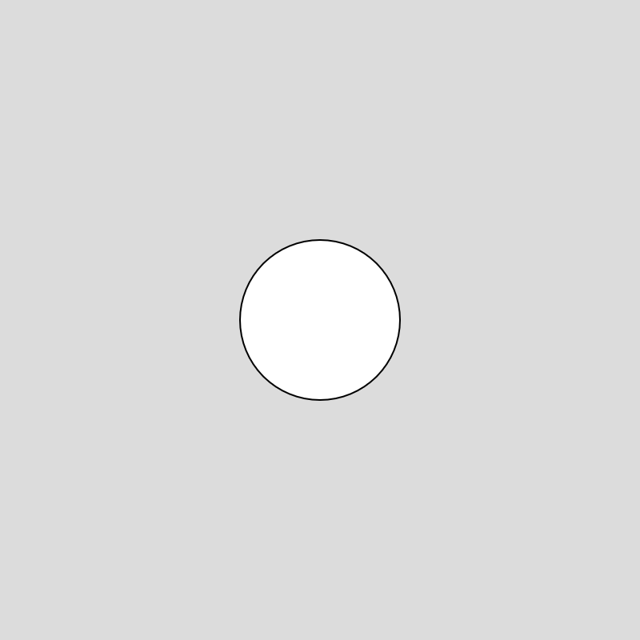

# p5, Shapes && Color

## About p5.js

[p5.js Website](https://p5js.org/)

[p5.js Reference](https://p5js.org/reference/)

[Processing Foundation Website](https://processingfoundation.org/)

p5.js is an open source code editor for artist, designer, and beginner programmers. It is a JavaScript library adaptation of the open source project Processing developed by [Casey Reas](https://reas.com/) and [Ben Fry](https://www.benfry.com/) in 2001. p5.was first developed by artist [Lauren Lee McCarthy](https://get-lauren.net/) in 2013.


## p5.js Editor

[p5.js Editor](https://editor.p5js.org/)

<figure> <figcaption>Interface of p5 Editor</figcaption> </figure>

The interface of the p5 Editor is fairly simple:

- The area on the left is where we can write our instructions (also known as *code*) for our artworks.
- The play button at the top allows us to run our code.
- The stop button stops our code.
- The top menus allow us to access various options related to the p5 editor.

---

### Customizing your p5 editor

You can change to **High Contrast** mode by clicking on the **gear icon** and going to **General Settings**.

You can also customize your **Text Size** for easier reading.

---

### Saving and Renaming

You can save your sketch by pressing **ctrl+s** of navigating to **file** > **save**.

You can rename your sketch by clicking on your project name next to the pencil icon.

## Calling Functions

Calling functions such as `createCanvas(400,400);` consists of 4 parts:

1. Function name - `createCanvas`
2. Open and closed parentheses - `()`
3. Parameters - amount specific to each function - `createCanvas(400,400)`
4. Semicolon - this tells p5.js to move to the next line of code - `;`

## createCanvas()
[Reference](https://p5js.org/reference/p5/createCanvas/)

`createCanvas()` is a function that sets the size of our canvas.

Syntax: `createCanvas(w, h)`

Parameters

- **w**		- width
- **h**		- height

## Syntax

**Syntax** is the word we use to describe the particular writing style of a programming language. Every programming language has a different **syntax**.

## Comments

We can annotated our code by using comments. Comments are bits of text written in the editor that our computer ignores. We can start a comment by typing `//`.

### Example:

```js hl_lines="2"
function setup(){
    //Create a canvas that is 400 pixels for width and height
    createCanvas(400,400);
}

```


## Errors

Computer languages are very specific about using the correct syntax. If our syntax is incorrect, we'll will receive an error.

### Example:

If I spell 'createCanvas()' incorrectly, my sketch won't run, and p5 will let me know I have an error.

```js hl_lines="3"
function setup(){
    //Set our sketch to 400 by 400 pixels
    createCanva(400,400);
}
```
<figure> <figcaption>Error message</figcaption> </figure>

This error says "createCanva is not defined" , becuase the p5.js editor does not know what the function createCanva() is.


## setup() and draw()

We'll get more into how `setup()` and `draw()` function in the next class. For now, we can think of `setup()` as where we set up our sketch by drawing our canvas, and `draw()` is where we can make our drawing. We want to make sure that our code is in between the `{ }` of the function.


## Coordinate System

Unlike a standard Cartesian coordinate system which might be familiar to you from previous studies in math, the origin, or `(0,0)` position of our canvas is *not* in the center. `(0,0)` is at the top left corner for our p5.js canvas.

<figure> <figcaption>Coordinate system of p5.js</figcaption> </figure>

## Shapes

- `line()`
- `circle()`
- `rect()`
- `square()`
 
---
### line()

[Reference](https://p5js.org/reference/p5/line/)

`line(x1, y1, x2, y2)` is a function that draws a line to our canvas.

Example:

```js hl_lines="6"
function setup(){
    createCanvas(400,400);
}
function draw(){
    background(220);
    line(100,100,300,300);
}
```
<figure> <figcaption> </figcaption> </figure>
---

### **circle()**

`circle(x, y, diameter)` is a function that draws a circle to our canvas.

[Reference](https://p5js.org/reference/p5/circle/) 

#### Example:

```js hl_lines="6"
function setup(){
    createCanvas(400,400);
}
function draw(){
    background(220);
    circle(200,200,100);
}
```
<figure> <figcaption> </figcaption> </figure>

---
### rect()

[Reference](https://p5js.org/reference/p5/rect/) 

`rect(x, y, w, h)` draws a rectangle to our screen.

By default, the x and y position of our square is anchored to the upper left corner.

### Example:

```js hl_lines="7"
function setup(){
    createCanvas(400,400);
}

function draw(){
    background(127);
    rect(10,10,200,300);
}
```

<figure> <figcaption> </figcaption> </figure>

---

### square()

For drawing a rectangle with equal sides, we can alternatively use the `square()` function:

[Reference](https://p5js.org/reference/p5/square/) 

Syntax: `square(x, y, size)`	

### Example:

```js hl_lines="7"
function setup() {
  createCanvas(400, 400);
}

function draw() {
  background(220);
  square(200, 200, 100);
}

```
<figure> <figcaption> </figcaption> </figure>

## Drawing Order

The order that we write our code is important! p5.js "reads" our code from the top to bottom, just like we do. Each shape is drawn on top of the previous shape.

### Examples: 

Larger circle hides smaller circle:

```js
function setup(){
    createCanvas(400,400);
}

function draw(){
    background(127);
    circle(200,200,100);
    circle(200,200,200);
}
```
<figure> <figcaption> </figcaption> </figure>

---

Smaller circle on top of larger circle:

```js
function setup(){
    createCanvas(400,400);
}

function draw(){
    background(127);
    circle(200,200,200);
    circle(200,200,100);
}
```
We'll see the smaller circle drawn on top of the larger one:

<figure> <figcaption> </figcaption> </figure>

## Settings and Attributes

- `rectMode()`
- `noStroke()`
- `noFill()`

---

### rectMode()

[Reference](https://p5js.org/reference/p5/rectMode/)

We can modify how rectangles are drawn by using the function `rectMode()`.

`rectMode()` can take in a few parameters, but we will focus on `CENTER` and `CORNER`

`rectMode(CORNER)` is the default behavior with our rectangles being drawn from the upper left corner.

`rectMode(CENTER)` will draw our rectangles from their center position

#### Example:

```js hl_lines="7 9"
function setup() {
  createCanvas(400, 400);
}

function draw() {
  background(220);
  rectMode(CENTER);
  square(200, 200, 100);
  rectMode(CORNER);
  square(200, 200, 100);
}
```

<figure> <figcaption> </figcaption> </figure>
---

### noStroke()
[Reference](https://p5js.org/reference/p5/noStroke/)

`noStroke()` is a settings function that disables points, lines and outlines.

Example:

Note: because draw loops continuously `noStroke()` effects all shapes. The effect could be interrupted with a `fill()` (see below).

```js hl_lines="9"
function setup() {
  createCanvas(400, 400);
}

function draw() {
  background(220);
  rectMode(CENTER);
  square(200, 200, 100);
  noStroke();
  rectMode(CORNER);
  square(200, 200, 100);
}
```

<figure> <figcaption> </figcaption> </figure>

---

### noFill()

`noFill()` disables fill for shapes.

Example:

```js hl_lines="8 9 10"
function setup() {
  createCanvas(400, 400);
}

function draw() {
  background(220);
  noFill();
  circle(200, 200, 150);
  circle(100, 200, 150);
  circle(300, 200, 150);
}
```


## Color

Colors in p5.js are Red, Blue, Green or RGB colors by default.

RGB and Alpha values have a range of 0-255, with 255 being full brightness.

Some functions that take color parameters:

- `background()` - fills the canvas with color [Reference](https://p5js.org/reference/p5/background/)
- `fill()` - changes the fill color of shapes [Reference](https://p5js.org/reference/p5/fill/)
- `stroke()` - changes the fill color of dots, lines and outlines `stroke()` [Reference](https://p5js.org/reference/p5/stroke/)

Each of these function can take a different numbers of parameters for different results:

- `fill(g)` - gray scale value
- `fill(r,g,b)` - red, blue and green values
- `fill(r, g, b, a)` - red, blue green and alpha (or opacity) values 

### Examples:

RGB values:

```js hl_lines="5  7 8"
function setup() {
  createCanvas(400, 400);
}
function draw() {
  background(113, 168, 88);
  strokeWeight(20);
  stroke(153, 153, 204)
  fill(0, 88, 172);
  circle(200, 200, 300);
}
```

In this sketch, notice the addition of `strokeWeight()`, which changes the thickness of dots, lines and outlines.

<figure> <figcaption> </figcaption> </figure>

---

Gray values:

```js hl_lines="5  8 10"
function setup() {
  createCanvas(400, 250);
}
function draw() {
  background(127);
  rectMode(CENTER);
  noStroke();
  fill(255);
  square(100, 125, 150);
  fill(0);
  square(300, 125, 150);
}
```

<figure> <figcaption> </figcaption> </figure>

---

Alpha:

```js hl_lines="7 9 11 13"
function setup() {
  createCanvas(400, 200);
}
function draw() {
  background(153, 153, 204);
  noStroke();
  fill(255, 207, 119, 255);
  circle(50, 100, 100);
  fill(255, 207, 119, 192);
  circle(150, 100, 100);
  fill(255, 207, 119, 127);
  circle(250, 100, 100);
  fill(255, 207, 119, 63);
  circle(350, 100, 100);
}
```

<figure> <figcaption> </figcaption> </figure>


## Saving an Image of you sketch

To save an image of your sketch, you can right click on your canvas and click on **Save image as...** 

## Sharing your Sketch

To share your sketch from p5.js:

1. Make sure you are logged in and your sketch is saved.
2. Navigate to **File** -> **Share**
3. You can copy your Fullscreen or Edit link to share with others! (We'll discuss Embed later).


