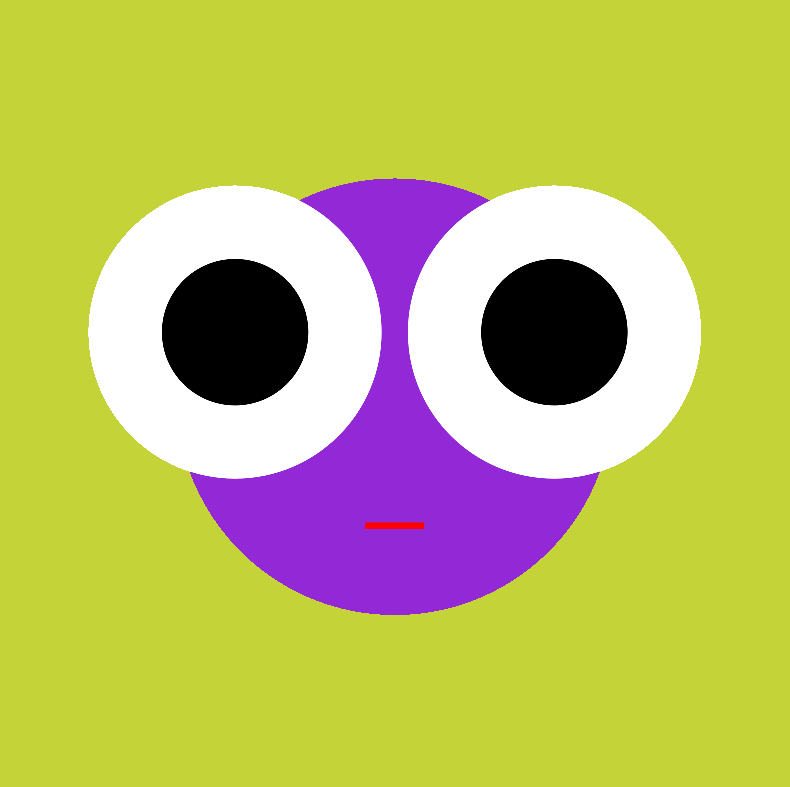

<script>hljs.highlightAll();</script>

<script>
// Get the header element
let header = document.querySelector('header');

// Get the height of the header
document.querySelectorAll('a[href^="#"]')
.forEach(function (anchor) {
    anchor.addEventListener('click', 
    function (event) {
        event.preventDefault();

        // Get the target element that 
        // the anchor link points to
        let target = document.querySelector(
            this.getAttribute('href')
        );
        
        let headerHeight = header.offsetHeight*2;
        
        let targetPosition = target
            .getBoundingClientRect().top - headerHeight;

        window.scrollTo({
            top: targetPosition + window.scrollY,
            behavior: 'smooth'
        });
    });
});
</script>

# Variables

> `RECAP:` What we learned last class:

> - What is Processing?
> - How to code essential shapes
> - How to code colors
> - How to code attributes

> `PLAN:`

> - The flow of Processing
> - `setup()` and `draw()`
> - How to write blocks of code
> - `mouseX` and `mouseY`
> - `mousePressed()`
> - `width` and `height`
> - Basic math in Processing
> - How to make our own variables
> - Types of variables
> - How to use incrementation operators
> - `random()`
> - Independent exercise: Random face
## setup() and draw()

`setup()` -> The starting conditions of our Processing sketch.

`draw() ` -> The continuous loop of our Processing sketch.

<figure> <figcaption>Setup condition of a tennis match (Serena vs. Venus Williams, 2027)</figcaption></figure>
<figure> <figcaption>Draw condition of a tennis match (Serena vs. Venus Williams, 2027)</figcaption></figure>
<figure> <figcaption>Setup condition of a Pong</figcaption></figure>
<figure> <figcaption>Draw condition of a Pong</figcaption></figure>
<figure> <figcaption>Setup condition of a Processing sketch, just size()</figcaption></figure>
<figure> <figcaption>Drawing condition of a Processing sketch</figcaption></figure>

## Code Block

To get this logic of setting up our sketch with `setup()` then continually drawing our sketch with `draw()` , we need to learn how to add these functions to our code. To do that we need to make a code block. In short, a code block is a section of code that is grouped together.

Example:

```java
void setup(){
	//some code
	//some more code
	//even more code
}
```

This code block above consists of a few elements:

1. `void` - This is a *return type* - we'll touch on this later in the course. Until then, we will be using this keyword `void`.
2. `setup()` - This is the name of our function. `setup()` is a special function that Processing already knows how to handle.
3. `{ }` - Open and closed curly brackets, these indicate where we will write our code.
4. **Body** - this is just the code that we will be writing.

Both `setup()` and `draw()` in our Processing sketch would look like this:

```java
void setup(){
	
}

void draw(){

}
```

>`NOTE`: Unlike when we were drawing without `setup()` and `draw()`, the order of these functions doesn't matter. We could reverse their positions and `setup()` would still run first. *However*, the order inside our code blocks *does* matter. Code will be executed from the top line to the bottom.

## Drawing with Variables

Let's start by going over all we did last class by using the following to draw a circle:

- `size()`
- `background()`
- `noStroke()`
- `fill()`
- `circle()`

```java
size(800,400);
background(12,123,220);
noStroke();
fill(255,194,10);
circle(400,200,80);
```
<figure> <figcaption>Result of the above Processing code</figcaption></figure>

Now let's put everything in either the `setup()` or `draw()` functions.

For now, we'll put our `size()` in `setup()` and everything else in `draw()`.
```java
void setup(){
	size(800,400);
}

void draw(){
	background(12,123,220);
	noStroke();
	fill(255,194,10);
	circle(400,200,80);
}
```
<figure> <figcaption>Result of the above Processing code</figcaption></figure>

We added a bunch more code, but everything looks the same!

Looking more closely at `draw()`, we can see that even though draw is happening over and over again, its drawing the same thing!

In order to make our sketch draw dynamically, we need to change the values of our sketch dynamically. We can do this with **variables**

## mouseX and mouseY

To start we'll use some of Processing's built-in variables.

[Reference](https://processing.org/reference/mouseX.html)

`mouseX` is a variable that always stores our mouse's horizontal position.
`mouseY` is a variable that always stores our mouse's vertical position.

These values update as we move our mouse!

As an experiment, let's replace our `circle()` x value with `mouseX`

```java
	circle(mouseX,200,80);
```

<figure> <figcaption>Our circle now follows the horizontal position of our mouse</figcaption></figure>

If we change the y value to `mouseY`:

```java
	circle(mouseX,mouseY,80);
```

<figure> <figcaption>Our circle now follows wherever our mouse goes</figcaption></figure>

Let's see what happens if we move our `background()` to the top of our `setup()`. Remember, this will cause `background()` to only run once.

```java
void setup(){
	size(800,400);
	background(12,123,220);
}

void draw(){
	noStroke();
	fill(255,194,10);
	circle(mouseX,mouseY,80);
}
```

<figure> <figcaption>We made a painting program!</figcaption></figure>

## mousePressed()

`mousePressed()` is a special function within Processing that is called every time we click our mouse. We can use this to clear our drawing to start on a fresh background.

To use `mousePressed()` we need to make a new block of code. To clear our background when our mouse is pressed, we can add a new `background()` in our `mousePressed()` function.

```java
void setup(){
	size(800,400);
	background(12,123,220);
}

void draw(){
	noStroke();
	fill(255,194,10);
	circle(mouseX,mouseY,80);
}

void mousePressed(){
	background(12,123,220);
}
```
<figure> <figcaption>We made another painting program!</figcaption></figure>

As a note, `mouseX` and `mouseY` can replace any value in our sketch.

If I move my `background()` from `setup()` to `draw()` and replace my circle diameter with `mouseX`.

```java
	circle(400, 200, mouseX);
```
Our `mouseX` variable now changes the size of our circle!

<figure> <figcaption> Changing the size of our circle with a variable</figcaption></figure>

## In-class Exercise: Painting Program

Spend some time using the sketch we wrote to create your own painting program!

Try adjusting the opacity value in your `fill()` to get new results!

As a bonus, see if you can save your drawing every time you click your mouse using `save()`.

## width and height

Some other built in Processing variables include `width` and `height`.

These variables always store the width and height of my sketch.

```java
void setup(){
	size(800,400);
}

void draw(){
	background(12,123,220);
	noStroke();
	fill(255,194,10);
	circle(width/2,height/2,80);
}
```

 

## Arithmetic Operators

- `+` - Addition 
- `-` - Subtraction
- `*` - Multiplication
- `/` - Division
- `=` - Equals

## What is a Variable?

What is `mouseX` or `width`?

Variables are named storage location in our computer's memory where we can store values.

`mouseX` and `width` are both named storage location where Processing is constantly updating their associated values.

<figure> <figcaption>Simplified drawing of variables in memory</figcaption></figure>

## Making our Own Variable

<figure> <figcaption>Let's work towards this example</figcaption></figure>

### Steps of a Variable

- Type of variable
- Name of variable
- Initialize variable

### Types

System Variables

- `int` - whole numbers
- `float` - decimal numbers
- ...and many more

Processing Variables

- `color` - type for holding a color value 
- ...and many more

Ones we'll use later on 

- `String` - words and sentences
- ...and many more

### Name

We can name our variable anything, but it is good to use a name that allows us to keep track of what we want it to do. As an example, `circleX` to control the x position of our circle.

Some rules to follow:

- Lower case letter to start `Dog` vs. `dog`
- No numbers as first character `1dog` vs. `dog1`
- No spaces `black cat` vs. `blackCat`
- use camelCase `blackcat` vs. `blackCat`
- Don’t use reserved keywords or existing Processing variable names `int` vs. `numberOfCats`

### Initialize

Give our variable an initial value to start with.

We can do this within a block of code:

```java
float circleX;

void setup(){
	size(800,400);
	circleX = 40;
}
```
Or, when we declare our variable:

``` java
float circleX = 40;

void setup(){
	size(800,400);
}
```

### Variable Scope

Variables have two levels of scope, **global** and **local**.

We won't go into too much detail about this now, but in short:

**Global** variables are declared at the top of our sketch. They can be used within any block of code.

**Local** variables are declared within a function and can only be used within that function.

### Making our Circle Move

After we declare the type and name of our variable and initialize its value, we should have this sketch:

```java
float circleX = 0;

void setup(){
  size(800,400);
  
}

void draw(){
  background(12,123,220);
  noStroke();
  fill(255,194,10);
  circle(400,200,80);
}
```

Then we need to replace our circle's X value with our new variable:

```java
circle(x,200,80);
```

Lastly, we need a way to increase our variable over time. For this, we can use an incrementation operator.

## Incrementation Operators

We need to increase our variable by a certain value, then assign that new value back to our variable.

- `ourVariable = ourVariable+1` = `ourVariable+=1` = `ourVariable++`
- Subtraction - `ourVariable-=2`
- Multiplication - `ourVariable*=2`
- Division - `ourVariable/=2`

To move our circle, we can increment our variable `circleX` by `1` each time `draw()` is called.

```java
float circleX = 0;

void setup(){
  size(800, 400);
  
}

void draw(){
  background(12, 123, 220);
  noStroke();
  fill(255, 194, 10);
  circle(circleX, 200, 80);
  circleX += 1;
}
```

<figure> <figcaption>Our moving circle!</figcaption></figure>

We can change how fast the circle is moving by changing the value `circleX` is changing by.

```java
  circleX += 20;
```
<figure> <figcaption></figcaption></figure>

## random()
[Reference]()

Syntax:	

- `random(high)`
	- returns a random value between **0** and **high**
- `random(low,high)` 
	- returns a random value between **low** and **high**

Parameters

- **low**	- (float) lower limit
- **high**	- (float) upper limit

This is the first function we’ll be using that returns a value!

### Using Random

We can use `random()` to give `circleX` a random value.

```java
float circleX = random(0,width);
```

<figure> <figcaption></figcaption></figure>

We can use `random()` to give our circle a random size each time we press the mouse!

```java
float circleSize = 0;

void setup(){
  size(800, 400);
  
}

void draw(){
  background(12, 123, 220);
  noStroke();
  fill(255, 194, 10);
  circle(width/2, height/2, circleSize);
  
}

void mousePressed(){
  circleSize = random(0,width);
}
```

<figure> <figcaption></figcaption></figure>

Or, by moving our `background()` and adding in some more variables, we can make many circles appear randomly on our screen.

Variables:

- `x`
- `y`
- `a`
- `r`
- `b`
- `g` 

``` java
float y;
float x; 
float a;
float r;
float g;
float b;

void setup(){
  size(800, 400);
  background(12, 123, 220);
}

void draw(){
  
  noStroke();
  
  y = random(height);
  x = random(width);
  a = random(60,200);
  r = random(200,255);
  g = random(200,255);
  b = random(100);
  
  fill(r, g, b,a);
  circle(x, y,30);
  
}
```

<figure> <figcaption></figcaption></figure>

## Independent Exercise: Face Generator

**DUE: By beginning of next class**

<figure> <figcaption></figcaption></figure>

Make a new Processing sketch and copy the example code below. Read this code and play around with it to figure out how it works - a large part of learning to program is by reading the code of others!

``` java
float faceSize;
float eyeSize;
float eyeX;
float eyeY;
float mouthY;
float mouthSizeX;
float mouthSizeY;

void setup() {
  size(800, 800);
}

void draw() {
  //face
  fill(147, 41, 214);
  circle(width/2, height/2, faceSize);

  //eyes
  fill(255);
  circle(width/2+eyeX, height/2-eyeY, eyeSize);
  circle(width/2-eyeX, height/2-eyeY, eyeSize);

  //pupils
  fill(0);
  circle(width/2+eyeX, height/2-eyeY, eyeSize*.5);
  circle(width/2-eyeX, height/2-eyeY, eyeSize*.5);

  //mouth
  fill(255, 0, 0);
  rectMode(CENTER);
  rect(width/2, height/2+mouthY, mouthSizeX, mouthSizeY);
}

void mousePressed() {
  noStroke();

  background(random(100, 255), random(100, 255), random(60));

  //face
  faceSize = random(300, width*.75);

  //eyes
  eyeSize = faceSize * random(.1, .7);
  eyeX = random(faceSize/10, faceSize/2);
  eyeY = random(faceSize/10, faceSize/5);

  //mouth
  mouthY = random(faceSize/10, faceSize/2);
  mouthSizeX = faceSize*random(.1, .8);
  mouthSizeY = mouthSizeX*random(.1, .2);
}
```
Use this code to make your own custom face generator! Maybe you add a nose, or hair! Or maybe you start from scratch and try to make your own custom generator. This is only an exercise, so play around and see what you can come up with! The only requirement of this exercise is that you add one more shape that has its size, position, or color, controlled by variables. See if you can see the relationships between the different shapes to add your own features.

### Submit

In the class Discord, share 3 (or more) of your favorite faces your generator made. You can capture the images using screenshots or the `save()` function in Processing.

[Upload Link](https://scrippscollege.app.box.com/f/2e0361aa9b4549c8b82c644533daad99)

Upload:

A zipped folder containing your Processing sketch as well as the three of your favorite images from the generator.

Your Zipped folder should be named using the following format:
Firstname_LastName_FaceGenerator

If you make a mistake and need to upload another folder, append the zipped file name with a numerical value:

i.e. Firstname_LastName_FaceGenerator_02

> **How to Zip a folder:**
> 
> [Windows](https://support.microsoft.com/en-us/windows/zip-and-unzip-files-8d28fa72-f2f9-712f-67df-f80cf89fd4e5)
> 
> [MacOS](https://support.apple.com/guide/mac-help/zip-and-unzip-files-and-folders-on-mac-mchlp2528/mac)


