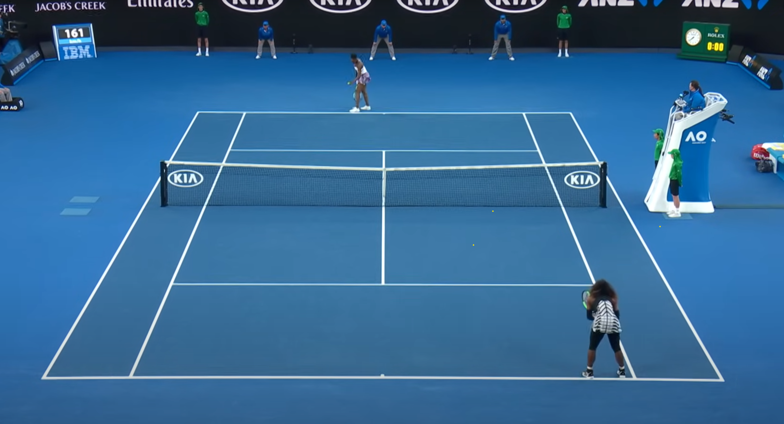

<script src="../assets/sketches/p5.js"></script>
<script src="../assets/sketches/code_02/code_02_01.js"></script>
<script src="../assets/sketches/code_02/code_02_02.js"></script>

<script src="../assets/sketches/code_02/code_02_04.js"></script>
<script src="../assets/sketches/code_02/code_02_05.js"></script>
<script src="../assets/sketches/code_02/code_02_06.js"></script>
<script src="../assets/sketches/code_02/code_02_07.js"></script>
<script src="../assets/sketches/code_02/code_02_08.js"></script>
<script src="../assets/sketches/code_02/code_02_09.js"></script>

<script src="../assets/sketches/code_02/code_02_11.js"></script>
<script src="../assets/sketches/code_02/code_02_12.js"></script>
<script src="../assets/sketches/code_02/code_02_13.js"></script>
<script src="../assets/sketches/code_02/code_02_14.js"></script>

# Variables && Randomness

## Overview

What we learned last class:

- What is p5.js?
- How to code essential shapes
- How to code colors
- How to code attributes

Class Overview:

- The flow of p5.js
- `setup()` and `draw()`
- How to write blocks of code
- `mouseX` and `mouseY`
- `mousePressed()`
- `width` and `height`
- Basic math in p5.js
- How to make our own variables
- How to use incrementation operators
- `random()`

## setup() and draw()

`setup()` and `draw()` are functions that control the flow of our p5 sketches.

`setup()`: The starting conditions of our p5 sketch.

`draw() `: The continuous loop of our p5 sketch.

<figure> <figcaption>Setup condition of a tennis match (Serena vs. Venus Williams, 2027)</figcaption></figure>
<figure> <figcaption>Draw condition of a tennis match (Serena vs. Venus Williams, 2027)</figcaption></figure>
<figure> <figcaption>Setup condition of a Pong</figcaption></figure>
<figure> <figcaption>Draw condition of a Pong</figcaption></figure>
<div id="01"></div>
<small>Setup condition of p5 sketch</small>

<div id="02"></div>
<small>Draw condition of p5 sketch (Click to restart)</small>

## Code Blocks

A code block is a section of code that is grouped together. Code blocks can appear as **function** and as other groupings of code such as **conditional statements** or **classes**.

Example:

```js
function setup(){
	//some code
	//some more code
	//even more code
}
```

This code block consists of four elements:

1. `function` - This designates our code block as a function.
2. `setup()` - This is the name of our function.
3. `{ }` - Open and closed curly brackets, these indicate where we will write our code.
4. **Body** - The code we will write.

>`NOTE`: These **function** code blocks can be arranged in our p5 sketch in any order.

## Variable Basics

In short, variables are values that change as our program runs. These values are *variable*, meaning they are able to change.

In this class, we'll be using two types of variables:

- p5.js variables: These are built-in variables that are part of the library.
- Custom variables: These are variables that we define ourself for use in our particular program.

## mouseX and mouseY

[Reference](https://p5js.org/reference/p5/mouseX/)

`mouseX` is a variable that always stores our mouse's horizontal position.
`mouseY` is a variable that always stores our mouse's vertical position.

These values update as we move our mouse!

### Examples:

---

`mouseX` Tracking:

```js hl_lines="9"
function setup(){
  createCanvas(400,400);
}

function draw(){
  background(12,123,220);
  noStroke();
  fill(255,194,10);
  circle(mouseX,200,80);
}
```

<div id="04"></div>

---

`mouseX` and `mouseY` Tracking:

```js hl_lines="9"
function setup(){
  createCanvas(400,400);
}

function draw(){
  background(12,123,220);
  noStroke();
  fill(255,194,10);
  circle(mouseX,mouseY,80);
}
```
<div id="05"></div>

---

`mouseX` size:

```js hl_lines="9"
function setup(){
  createCanvas(400,400);
}

function draw(){
  background(12,123,220);
  noStroke();
  fill(255,194,10);
  circle(200,200,mouseX);
}
```
<div id="08"></div>
---

Drawing Program with `mouseX` and `mouseY` :

```js hl_lines="9"
function setup(){
	createCanvas(400,400);
	background(12,123,220);
}

function draw(){
	noStroke();
	fill(255,194,10);
	circle(mouseX,mouseY,10);
}
```

<div id="06"></div>

## mousePressed()

[Reference](https://p5js.org/reference/p5/mousePressed/)

`mousePressed()` is a special function within p5 that is called every time we click our mouse.

To use `mousePressed()` we need to make a new **function** block of code.

---

### Examples:
`mousePressed()` Drawing Program:

This program resets our drawing every time we click the mouse by redrawing our `background()`.

```js hl_lines="12 13 14"
function setup(){
	createCanvas(400,400);
	background(12,123,220);
}

function draw(){
	noStroke();
	fill(255,194,10);
	circle(mouseX,mouseY,10);
}

function mousePressed(){
	background(12,123,220);
}
```

<div id="07"></div>


## width and height

- [Width Reference](https://p5js.org/reference/p5/width/)
- [Height Reference](https://p5js.org/reference/p5/height/)

`width` and `height` are built-in p5 variables that store the width and height of your canvas.

### Example: 

```js hl_lines="9"
function setup(){
	createCanvas(400,400);
}

function draw(){
	background(12,123,220);
	noStroke();
	fill(255,194,10);
	circle(width/2,height/2,80);
}
```

<div id="09"></div>
---


## Arithmetic Operators

We can alter the values of numbers and variables by using arithmetic operators.

- `+` - Addition 
- `-` - Subtraction
- `*` - Multiplication
- `/` - Division
- `=` - Equals

## What is a Variable?

What is `mouseX` or `width`?

Variables are named storage locations in our computer's memory where we can store values.

`mouseX` and `width` are both named storage location where p5 is constantly updating their associated values.

<figure> <figcaption>Simplified drawing of variables in memory</figcaption></figure>

## Making our Own Variables


### Steps to Making a Variable

- Stating `let`
- Name of variable
- Initialize variable
- Use the variable

---

### let

We can use the keyword `let` to begin declaring a variable.

Example:

```js
let frog;
let toad;
let bird;
```

In JavaScript, we don't need to tell our editor what type of variable we are making. In other words, we don't need to let JavaScript know if our variable is a Number, a word, or something else. In part, it is up to the artist to keep track of what type of variable we want each new variable to be.

Some variable types:

JavaScript variables:

- Number: both decimal and whole numbers
- String: words or sentences
- ...and many more

---

### Name

We can name our variable anything, but it is good to use a name that allows us to keep track of what we want it to do. As an example, `circleX` to control the x position of our circle.

Some rules to follow:

- Lower case letter to start `Dog` vs. `dog`
- No numbers as first character `1dog` vs. `dog1`
- No spaces `black cat` vs. `blackCat`
- use camelCase `blackcat` vs. `blackCat`
- Don’t use reserved keywords or existing p5 variable names.

---

### Initialize

To initialize our variable, we need to provide with an initial value using the `=` operator.

We can do this in `setup()` :

```js hl_lines="1 5"
let circleX;

function setup(){
	createCanvas(400,400);
	circleX = 0;
}
```
Or, when we declare our variable:

``` js hl_lines="1"
let circleX = 0;

function setup(){
	createCanvas(400,400);
}
```

---
### Use
After we declared and initialized our variable, we can use it in our sketch. Here `cricleX` replaces the `x` value of our `circle`.

Note: although we are using are variable, we are not changing it's values, so our sketch remains static.

```js hl_lines="12"
let circleX = 0;

function setup(){
  createCanvas(400,400);
  
}

function draw(){
  background(12,123,220);
  noStroke();
  fill(255,194,10);
  circle(circleX,200,80);
}
```

---

### Variable Scope

Variables have two levels of scope, **global** and **local**.

We won't go into too much detail about this now, but in short:

- **Global** variables are declared at the top of our sketch. They can be used within any block of code.

- **Local** variables are declared within a block of code and can only be used within that code block.

## Incrementation Operators

We can use incrementation operators to change the value of our variable over time. If I want to increase the value of `circleX` by `1` every time `draw()` is called, we can use the code:

```js
circleX = circleX+1;
```
Incrementation operations are a two part process:

1. Change the value of a variable (`circleX+1`)
2. Assign that value back to the variable (`circleX = circleX+1`)
---
Short hands for incrementation operators:

**Addition:**
```js
//All the same

circleX = circleX+1;
circleX += 1;
circleX ++;
```

**Subtraction:**
```js
//Both the same

circleX = circleX-1;
circleX -= 1;
```
**Multiplication:**
```js
//Both the same

circleX = circleX*2;
circleX *= 2;
```

**Division:**
```js
//Both the same

circleX = circleX/2;
circleX /= 2;
```

---
### Example:

Moving a circle using addition incrementation operator on `circleX` :

```js hl_lines="13"
let circleX = 0;

function setup(){
  createCanvas(400, 400);
  
}

function draw(){
  background(12, 123, 220);
  noStroke();
  fill(255, 194, 10);
  circle(circleX, 200, 80);
  circleX += 1;
}
```


<div id="11"></div>

<small>*Note: This example is repeating. Some extra code was added to make this example for the website. We'll learn more about this next class*.</small>

We can change how fast the circle is moving by the changing incrementation value.

```java
  circleX += 10;
```
<div id="12"></div>

<small>*Note: This example is repeating. Some extra code was added to make this example for the website. We'll learn more about this next class*.</small>

## random()
[Reference](https://p5js.org/reference/p5/random/)

Syntax:	

- `random(max)`
	- returns a random value between **0** and **max**
- `random(min,max)` 
	- returns a random value between **min** and **max**

Parameters

- **min**	- (Number) lower limit
- **max**	- (Number) upper limit

`random()` returns a number value. We can assign this value to variables or use the value as parameters in functions.

---
### Examples:

Random position on mouse click using `random()` :

```js hl_lines="18"
let circleX = 0;

function setup(){
  createCanvas(400, 400);
  
}

function draw(){
  background(12, 123, 220);
  noStroke();
  fill(255, 194, 10);
  circle(circleX, 200, 80);
  circleX += 1;
}

function mousePressed()
{
  circleX = random(0,width);
}
```

<div id="13"></div>

---

Collection of Dots using `random()` :

``` js hl_lines="17-22"
let x;
let y; 
let a;
let r;
let g;
let b;

function setup(){
  createCanvas(400, 400);
  background(12, 123, 220);
}

function draw(){
  
  noStroke();
  
  y = random(height);
  x = random(width);
  a = random(60,200);
  r = random(200,255);
  g = random(200,255);
  b = random(100);
  
  fill(r, g, b,a);
  circle(x, y,10);
  
}

mousePressed(){
  background(12, 123, 220);
}
```

<div id="14"></div>

Click to reset


