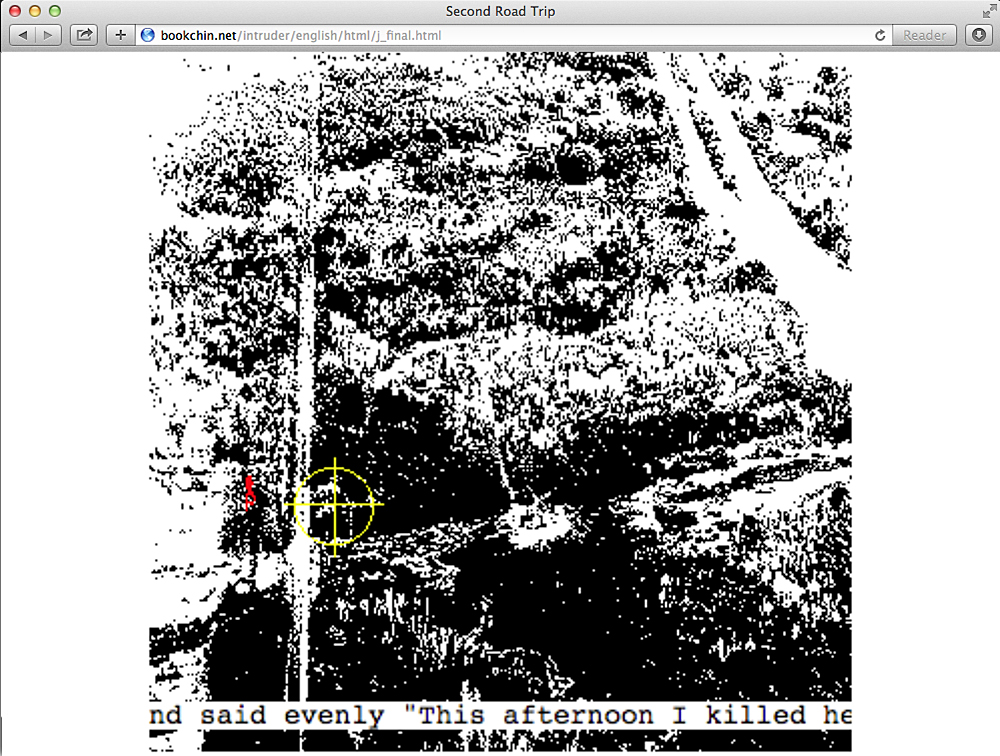
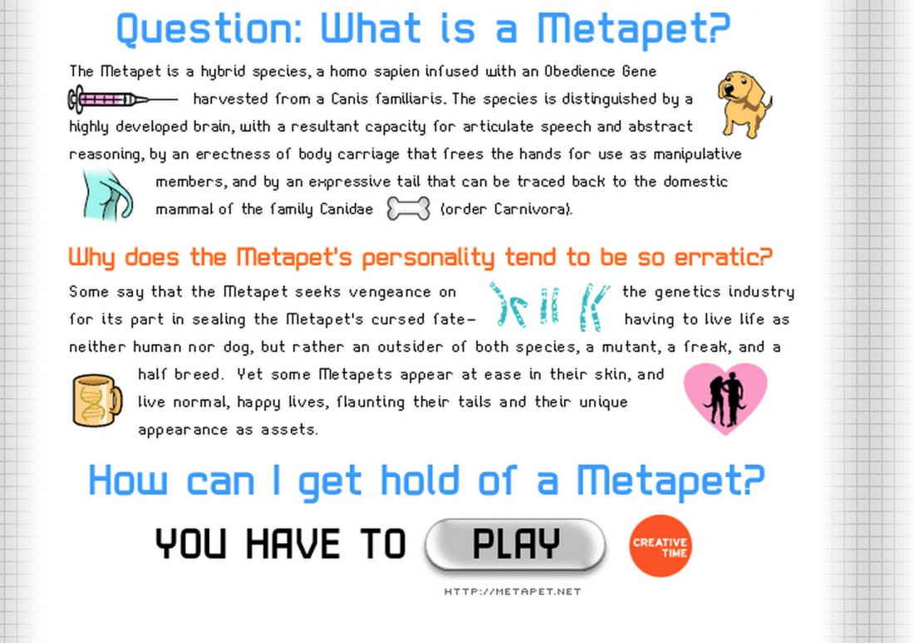
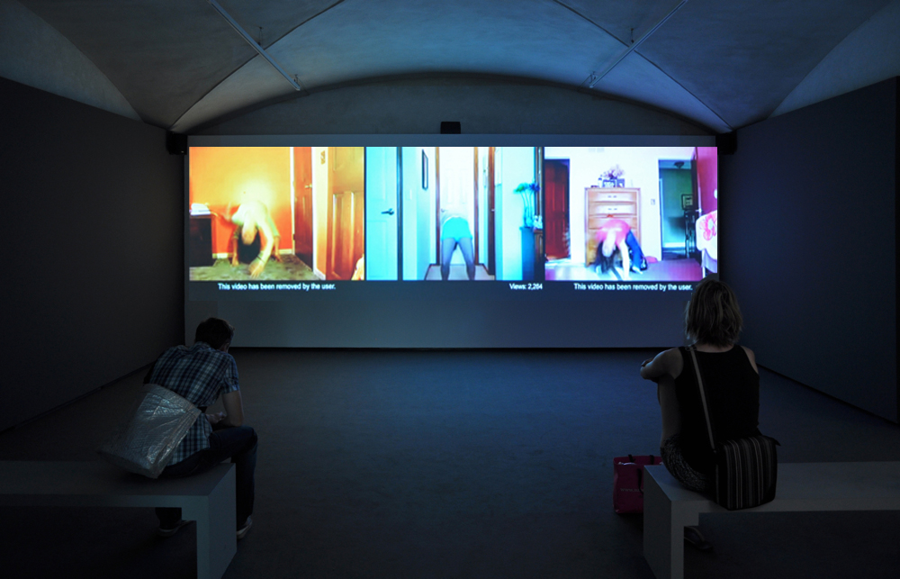

# Natalie Bookchin

## Information

Born. 1962 (USA)

[Artist Website](https://bookchin.net/)

## *The Intruder*

[Website](https://bookchin.net/projects/the-intruder/)

Web project, 1999

## *Metapet*

[Website](https://bookchin.net/projects/metapet/)

Online game (with Jin Lee) 2002

## *Mass Ornament*

[Website](https://bookchin.net/projects/mass-ornament/)

Single-channel video installation, surround sound 2009

<iframe title="vimeo-player" src="https://player.vimeo.com/video/5403546?h=c874d7e980" width="640" height="360" frameborder="0" referrerpolicy="strict-origin-when-cross-origin" allow="autoplay; fullscreen; picture-in-picture; clipboard-write; encrypted-media; web-share"   allowfullscreen></iframe>
