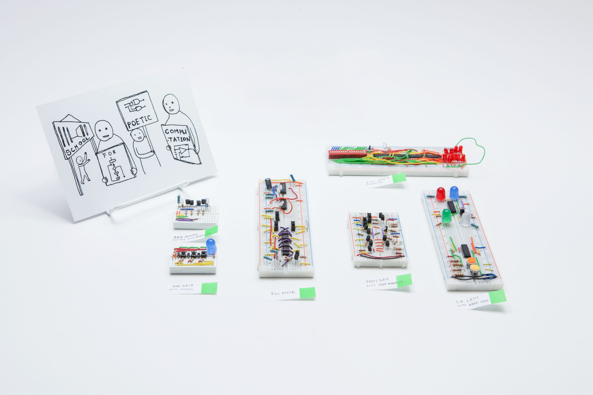

# Taeyoon Choi

## Information

Born. 1982 (USA)

[Artist Website](https://taeyoonchoi.com/)

## *Poetic Computation*

2012~2021

### Handmade Computers

[Website](https://taeyoonchoi.com/poetic-computation/handmade-computers/)

### School for Poetic Computation

[Website](https://sfpc.study/)

Cofounder of the the influential experimental learning center School for Poetic Computation

