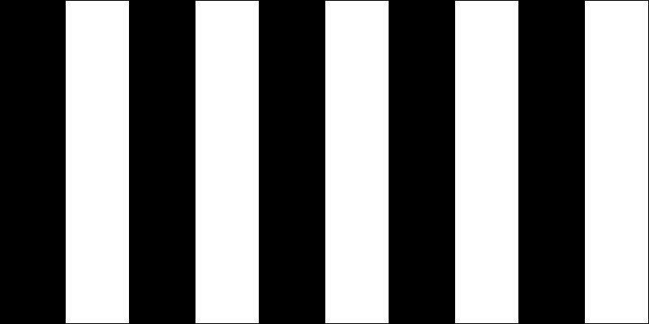

## Description

Use a `for` loop to create a repeating drawing within p5.js. Maybe you attempt to create concentric circles, or perhaps make you try to make rectangles of alternating colors that extend across your canvas? Refer to class notes for a refresher of `for` loops.

After a period of time, we will share a selection of these drawings with the class.

